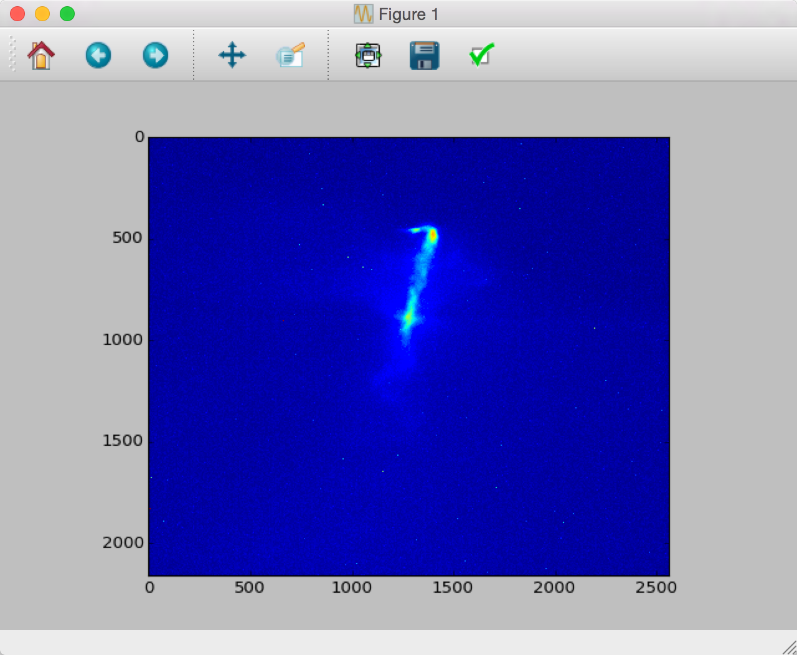

.. _api:

API
===

The :mod:`E200` package makes it easy to analyze datasets saved at FACET. In order to do analysis, some understanding of how data can be correlated in practice is necessary. For more information, see the :ref:`introduction`.

.. _loading-data:

Loading Data
------------

Before anything can be done, a dataset must be loaded. When loading data, only data contained in the :ref:`master file <master-file-type>` is loaded immediately. Other data, such as image data, must be loaded later. This is a practical consideration in order to load files quickly and avoid filling up memory, as there can be anywhere from one image to terabytes of images.

Data can be loaded in two main ways. The most accessible way is through :func:`E200.E200_load_data_gui`, which presents the user with a graphical file picker::

        import E200
        data = E200.E200_load_data_gui()

The file path picked is then passed through to :func:`E200.E200_load_data`. This function can, of course, be loaded directly instead of accessed through :func:`E200.E200_load_data_gui`. The function :func:`E200.E200_load_data` loads a file from a string::

        import E200
        filepath = 'nas/nas-li20-pm00/E217/2015/20150606/E217_17990/E217_17990.mat'
        data = E200.E200_load_data(filepath)

.. _data-class:

Drill Data Class
----------------

It becomes immediately obvious that loaded data is returned in the form of the class :class:`E200.classes.Drill`. The dataset's nested dictionary as returned from `h5py <http://www.h5py.org/>`_ is given by::

        data.read_file

It is cumbersome to find all of the nested dictionaries, as `tab completion <https://docs.python.org/3.4/tutorial/interactive.html#tab-completion-and-history-editing>` does not work for dictionaries in the Python interpreter. Each nested level must be explored individually::

        >>> list(data.read_file['data'].keys())
        ['VersionInfo', 'processed', 'raw', 'user']

Top Data Level
^^^^^^^^^^^^^^

The :class:`E200.classes.Drill` class anticipates this problem: it is far simpler to enter::

        >>> data.rdrill.data
        <E200.E200_load_data.Drill with keys:
        _hdf5
        VersionInfo
        processed
        raw
        user
        >

One can immediately see that this class includes useful members. Ignoring ``_hdf5``, which includes the dictionary for each level, the keys are:

* ``VersionInfo``: Information about the :ref:`DAQ <daq>` version used to collect data
* ``raw``: Data and references to data
* ``processed``: Data post-processed by other routines
* ``user``: Space to hold individuals' calculations

Raw Data Level
^^^^^^^^^^^^^^

Of these, only ``raw`` is expected to hold data. Exploring ``raw`` reveals its own levels::

        >>> data.rdrill.data.raw
        <E200.E200_load_data.Drill with keys:
        _hdf5
        arrays
        images
        metadata
        scalars
        vectors
        >

* ``images``: Cameras with images
* ``scalars``: Scalar :ref:`BSA data <bsa-data>` and data indicating :ref:`DAQ <daq>` settings 
* ``metadata``: Data about the dataset collected
* ``arrays``: Multi-dimensional :ref:`BSA data <bsa-data>` (not used)
* ``vectors``: List of :ref:`BSA data <bsa-data>` (not used)

Tree Tip Level
^^^^^^^^^^^^^^

At the tips of the nested data class are actual data. For instance, ``scalars.step_num`` (which is a record of the step in a scan the dataset was on) shows:

        >>> data.rdrill.data.raw.scalars.step_num
        <E200.E200_load_data.Drill with keys:
        _hdf5
        IDtype
        UID
        dat
        desc
        >

Of these, ``UID``, ``dat``, and ``desc`` are interesting:

* ``UID``: An array of the :ref:`UIDs <uid>` available
* ``dat``: An array of the data available
* ``desc``: A description of the data in ``step_num``

This holds true across all tree tips, except for in images, where ``dat`` is a file path to the data. While the file path is relative to the top of the directory holding all of the datasets, we have a way of loading images automatically, and this is not needed by the average analyst.

.. _uid:

UID
---

While it's possible to do a lot of statistical analysis off of a single measurement source, the real power of datasets is in correlating pieces of data. In order to do this, every single shot at FACET is designed to have a unique identification number or :ref:`uid`. Every piece of :ref:`BSA data <bsa-data>`, whether it is an image or a number, is correlated to a :ref:`uid`.

Limitations
^^^^^^^^^^^

There are a few problems that may arise when trying to collect :ref:`BSA data <bsa-data>`. The biggest is that, technically, it is not necessarily possible to start all of the data collection simultaneously. In this case, the :ref:`UIDs <uid>` for each shot should be collected correctly. But it is important to not assume that the beginnings or the ends line up. **In fact, it is a near certainty that the** :ref:`UIDs <uid>` **of images and data will NOT line up.**

Selecting Data by UID
^^^^^^^^^^^^^^^^^^^^^

The most obvious way to use :ref:`UIDs <uid>` is to create a master index of the desired :ref:`UIDs <uid>`. For example, it is possible to take only the first 10 :ref:`UIDs <uid>` common to ``step_num`` and ``step_value`` and use :func:`E200.E200_api_getdat` to load the corresponding data from any dataset::

        >>> import numpy as np
        >>> step_num = data.rdrill.data.raw.scalars.step_num
        >>> step_value = data.rdrill.data.raw.scalars.step_value
        >>> wanted_uids = np.intersect1d(step_num.UID, step_value.UID)[0:10]
        >>> dat_step_num = E200.E200_api_getdat(step_num, wanted_uids)
        >>> dat_step_val = E200.E200_api_getdat(step_value, wanted_uids)
        >>> dat_step_val.dat
        array([-2., -2., -2., -2., -2., -2., -2., -2., -2., -2.])
        >>> dat_step_num.dat
        array([ 1.,  1.,  1.,  1.,  1.,  1.,  1.,  1.,  1.,  1.])

Note: it's important to take the intersection. Without intersecting, it is impossible to be sure that the :ref:`UIDs <uid>` will exist for ``step_num`` and ``step_value``. The API function :func:`E200.E200_api_getdat` is designed to mitigate this problem by returning an instance of the class :class:`E200.E200_Dat.E200_Dat`. This class has members:

* :data:`E200.E200_Dat.E200_Dat.field`: The field retrieved (usually ``dat``)
* :data:`E200.E200_Dat.E200_Dat.uid`: The :ref:`UIDs <uid>` retrieved
* :data:`E200.E200_Dat.E200_Dat.dat`: The data retrieved, correlated by position to :ref:`uid`.

Selecting Data by Value
-----------------------

Another likely scenario is to select all of the shots that correspond to a value. For instance, it may be desirable to select only the second step of a scan. This can be done using :func:`E200.E200_api_getUID` to get the uids where ``step_num`` equals 2::

        >>> uids_step_num_2 = E200.E200_api_getUID(step_num, 2)
        >>> uids_step_num_2
        array([  1.79900002e+12,   1.79900002e+12,   1.79900002e+12,
                 1.79900002e+12,   1.79900002e+12,   1.79900002e+12,
                 1.79900002e+12,   1.79900002e+12,   1.79900002e+12,
                 1.79900002e+12,   1.79900002e+12,   1.79900002e+12,
                 1.79900002e+12,   1.79900002e+12,   1.79900002e+12,
                 1.79900002e+12,   1.79900002e+12,   1.79900002e+12,
                 1.79900002e+12,   1.79900002e+12,   1.79900002e+12,
                 1.79900002e+12,   1.79900002e+12,   1.79900002e+12,
                 1.79900002e+12,   1.79900002e+12,   1.79900002e+12,
                 1.79900002e+12,   1.79900002e+12,   1.79900002e+12,
                 1.79900002e+12,   1.79900002e+12,   1.79900002e+12,
                 1.79900002e+12,   1.79900002e+12,   1.79900002e+12,
                 1.79900002e+12,   1.79900002e+12,   1.79900002e+12,
                 1.79900002e+12,   1.79900002e+12,   1.79900002e+12,
                 1.79900002e+12,   1.79900002e+12,   1.79900002e+12,
                 1.79900002e+12,   1.79900002e+12,   1.79900002e+12,
                 1.79900002e+12,   1.79900002e+12,   1.79900002e+12,
                 1.79900002e+12,   1.79900002e+12,   1.79900002e+12,
                 1.79900002e+12,   1.79900002e+12,   1.79900002e+12,
                 1.79900002e+12,   1.79900002e+12,   1.79900002e+12])
        >>> uids_step_num_2.shape
        (60,)

In this case, there are 60 :ref:`UIDs <uid>` for step 2.

Loading Images
--------------

Loading images is special, as images aren't stored directly in the :ref:`master file <master-file-type>`. In this case, use :func:`E200.E200_load_images`::

        >>> camera = data.rdrill.data.raw.images.CMOS_ELAN
        >>> uid = camera.UID[0]
        >>> images = E200.E200_load_images(camera, uid)
        >>> images
        <E200.classes.E200_Image at 0x11ae082e8>
        >>> plt.imshow(images.images[0])
        <matplotlib.image.AxesImage object at 0x105e9c080>
        >>> plt.show()

The class :class:`E200.classes.E200_Image` has several members. The one of interest are:

* ``UID`` or ``uid``: An array of the :ref:`UIDs <uid>` available
* ``images``: An array of images
* ``imgs_subbed``: An array of images with background subtraction (experimental)
* ``image_backgrounds``: The background image for the image data

For Loops and Images
^^^^^^^^^^^^^^^^^^^^

If you want to iterate over images, it is advisable to use :class:`E200.E200_Image_Iter`::

        >>> for image in E200.E200_Image_Iter(camera, uids_step_num_2):
        >>>     (do something)
