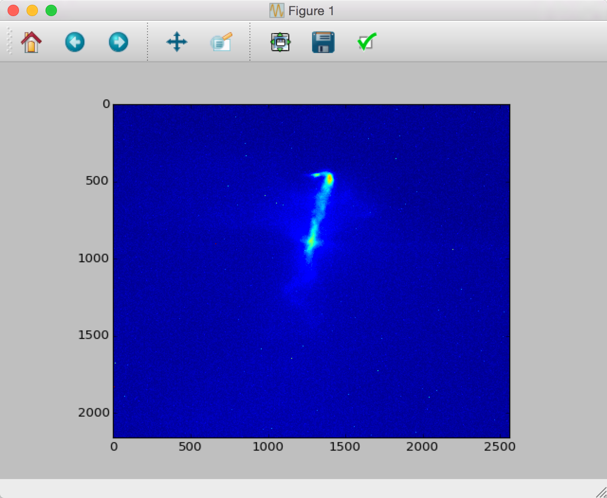

Introduction
============

This is the documentation for the Python interface to load and analyze FACET datasets. It is designed with an analysis envorinment consisting of iPython, Numpy, SciPy, Matplotlib, and PyQt4.

How Datasets are Saved
----------------------

At FACET, datasets are collected through use of the FACET data acquisition software typically referred to as "The DAQ." The DAQ software is written in Matlab, and triggers and collects data via EPICS. Data is stored in network attached storage (NAS) in Sector 20 at FACET, because currently the network does not support transmitting the data away from Sector 20.

There are two categories of underlying data at FACET: beam-synchronous-acquired (BSA) data and non-beam-synchronous-acquired (non-BSA) data. BSA data is correlated by shots; each shot should have a unique data point for each BSA data type. Non-BSA data is assumed to vary slowly and remain the same over the course of the data set and is taken only once at the beginning of a set. This assumption is not tested by the software- it is theoretically possible to record a dataset for hours, and non-BSA values will not update to reflect changing conditions.

Underlying Dataset File Types
-----------------------------

FACET saves several data types, which are linked together in a master file that represents a dataset. This master file sometimes contains data or references. Rather than have the user piece these disparate data together in an analysis, this package has the capability of loading and relating data as needed. This package was started in 2014 and can only load datasets taken since then.

Perhaps the most important linked data are images. Cameras record images to directories in the NAS. How they record images (what cameras are used, what file format is used, where they are stored in the NAS, etc.) has changed over time and may continue to change as technical needs evolve. Due to the changing nature of images, the E200 package is designed to account for these changes so the scientist can assume the images received need no further adjustment.

BSA and non-BSA data are saved in the master file itself. This has remained fairly stable. BSA and non-BSA data tend to be scalar in nature- one single number saved for each shot or dataset respectively. There has been no need for higher-dimensional data thus far, although the DAQ has anticipated this possible eventual need.

Master File Type
----------------

While Matlab can write `HDF5 files <https://www.hdfgroup.org/HDF5/>`_, the files it saves by default may not always conform to the HDF5 standard. While it is possible to force Matlab to write HDF5 files, in certain scenarios the time to save these files can be quite lengthy and cause problems. In order to read them in Python, they must first be translated by Matlab into HDF5, which Python can then load.  The data files follow a hierarchical structure, which is ideal for HDF5. Unfortunately, the de facto Python software for reading and writing HDF5 files is `h5py <http://www.h5py.org/>`_.  H5Py returns nested dictionaries, which, while a standard data type in Python, are awkward to access in any sort of automated format when developing in iPython. The E200 package attempts to address this deficit through custom nested classes that should make traversing the data structure simpler. The E200 package does preserve the original nested dictionaries.

Prerequisites
-------------

Python 3
^^^^^^^^

E200 works with Python 3 and up, which should be installed via apt-get on \*nix, `Macports <https://www.macports.org/>`_ on Apple machines, or downloaded from https://www.python.org/downloads/.

PyQt4
^^^^^

E200 requires PyQt4, which has dependencies of its own. Installation via apt-get or Macports is highly recommended in order to handle these dependencies.

It is possible, although difficult, to `install from source <http://pyqt.sourceforge.net/Docs/PyQt4/installation.html>`_, including dependencies. This was necessary on ``facet-srv20``; talk to Joel Frederico if you would like more information on running on ``facet-srv20``. If you would like to run on a \*nix machine without access to apt-get, you may have to compile from source. It is possible to `build against Qt 5 <http://pyqt.sourceforge.net/Docs/PyQt4/qt_v5.html>`_.

Installation
------------

There are a few ways to install E200. If you are unsure or want something more reliable (and also updated less frequently), install from PyPI.

From PyPI
^^^^^^^^^

You can install the most recent E200 version using `pip <https://pypi.python.org/pypi/pip>`_::

        sudo pip install E200

This will install E200 in your Python installation’s site-packages directory.

From the tarball release
^^^^^^^^^^^^^^^^^^^^^^^^

#. Download the most recent tarball from the `download page <https://pypi.python.org/pypi/E200>`_
#. Unpack the tarball
#. ``sudo python setup.py install``

Note that you have to have setuptools installed.

This will install E200 into your Python installation’s site-packages directory.

Installing the development version
^^^^^^^^^^^^^^^^^^^^^^^^^^^^^^^^^^

#. Install `git <https://git-scm.com/>`_ (available through Linux's apt-get and `Macports <https://www.macports.org/>`_ as well)
#. ``git clone git@github.com:joelfrederico/E200.git``
#. ``cd E200``
#. ``python setup.py develop``

Note that you have to have setuptools installed.

Basic Usage
-----------

This section gives you a brief introduction in loading datasets.

Access Data
^^^^^^^^^^^

First, a ``nas`` directory must be accessible. There are several ways to do this.

Copy data from Unix (rsync)
"""""""""""""""""""""""""""

The simplest method is to copy data from a source. The most universal method is to copy data from SLAC's Unix area, which is frequently synced from NAS::

        mkdir -p ~/FACET_data/<dataset>
        rsync -avPh <username>@noric.slac.stanford.edu:/nfs/slac/g/facetdata/<dataset> <dataset>

Generally, ``<dataset>`` has the form ``nas/nas-li20-pm00/E200/2015/20150602/E200_17712``.

The ``nas`` folder can now be found in ``~/FACET_data``.

Mount Local Copy (OS X Only)
""""""""""""""""""""""""""""

If you are using an Apple machine and either on the SLAC network it is possible to mount the drive directly to your system:

#. Open the Finder and press :kbd:`Command + k`
#. Enter the server address as: ``afp://pwfa.slac.stanford.edu``
#. Double-click on ``PWFA_5big`` to mount the drive

The ``nas`` folder can now be found in ``/Volumes/PWFA_5big``.

Load Data
^^^^^^^^^

The simplest and most-accessible way to load datasets is to use the ``E200.E200_load_data_gui()`` method::

        import E200
        data = E200.E200_load_data_gui()

If you have not loaded data before, you may be prompted to locate the ``nas`` folder.

Once loaded, a dataset can be displayed::

        camera = data.rdrill.data.raw.images.CMOS_ELAN
        uid = camera.UID[0]
        images = E200.E200_load_images(camera, uid)
        plt.imshow(images.images[0])
        plt.show()

(Note that this assumes the dataset recorded camera ``CMOS_ELAN``.) In OS X this opens a window:

